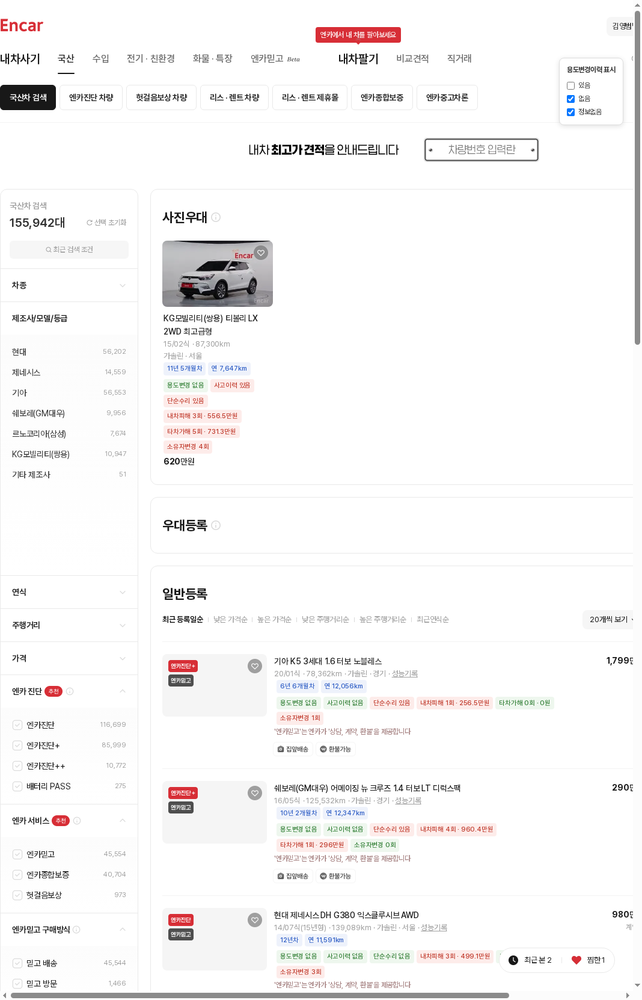

# 엔카 매물 목록 상세정보 표시기

엔카(encar.com) 중고차 검색 결과 목록에서, 원래는 매물 상세페이지에 들어가야만 볼 수 있는 다음 정보를 카드에 바로 표시하는 Chrome 확장 프로그램입니다.

- 용도변경이력 유무
- 사고이력 유무
- 단순수리 유무
- 보험사고이력(내차피해) — 횟수 / 금액
- 보험사고이력(타차가해) — 횟수 / 금액
- 소유자변경 횟수
- 보험이력 정보제공 불가능기간 유무 및 기간
- 신차대비 감가율(%)



또한 각 매물에 **차량 경과기간(X년 X개월차)**과 **연간 주행거리(km/년)** 뱃지를 함께 표시합니다. 목록에 이미 있는 연식·주행거리 텍스트만으로 계산하므로 API 호출 없이 즉시 표시됩니다.

화면 우측에는 **필터 패널**을 제공해, 용도변경이력과 단순수리 여부가 각각 "있음/없음/정보없음"인 매물을 선택적으로 숨기거나 보이게 할 수 있습니다(두 조건 모두 만족하는 매물만 표시). 설정은 브라우저에 저장되어 다음 방문에도 유지됩니다.

## 동작 원리

엔카 웹사이트가 내부적으로 사용하는 공개 API를 활용합니다.

1. `GET https://api.encar.com/v1/readside/vehicle/{listId}` — 목록의 매물 ID를 실제 `vehicleId`/`vehicleNo`로 변환, 신차대비 계산에 쓰는 `category.originPrice`(기본가)·`advertisement.price`(판매가)·`options.choice`(선택 옵션 코드)도 포함
2. `GET https://api.encar.com/v1/readside/inspection/vehicle/{vehicleId}` — 성능점검기록부(`accdient`, `simpleRepair`, `usageChangeTypes`)
3. `GET https://api.encar.com/v1/readside/record/vehicle/{vehicleId}/open` — 보험 사고이력(`myAccidentCnt/Cost`, `otherAccidentCnt/Cost`, `carInfoUse1s`/`carInfoUse2s`, `notJoinDate1~5`)
4. `GET https://api.encar.com/v1/readside/vehicles/car/{vehicleId}/options/choice` — 옵션 코드별 가격표(신차대비 계산 시 선택 옵션 가격 합산에 사용)

용도변경이력은 성능점검기록부의 `usageChangeTypes`뿐 아니라 보험이력의 용도 코드 이력(`carInfoUse1s`/`carInfoUse2s`)에 서로 다른 값이 남아 있는 경우(예: 렌트용 → 자가용)도 함께 반영합니다. 실제 상세페이지의 "차량이력 · 특이 사항: 렌트 이력" 표시는 후자로만 확인되는 경우가 있기 때문입니다.

보험이력 "정보제공 불가능기간"은 `notJoinDate1`~`notJoinDate5`(예: `202301~202605`)를 모아 표시합니다. 이 기간에는 보험사에 정보 제공이 되지 않아 사고이력을 조회할 수 없다는 뜻으로, "사고이력 없음"과는 다른 의미이므로 별도 뱃지로 분리했습니다.

신차대비 감가율은 `신차가(category.originPrice + 선택 옵션가 합계)` 대비 `현재 판매가(advertisement.price)`의 하락률로 직접 계산합니다. 엔카 상세페이지의 "신차대비" 표시는 자체 시세표 매칭에 실패하면 "-%"로 나오는 경우가 많아, 그 값을 그대로 가져오는 대신 확장에서 독자적으로 계산합니다(엔카가 화면에 표시하는 값과 정확히 일치하지 않을 수 있습니다). 기본가나 판매가 정보가 없는 매물은 "정보없음"으로 표시됩니다.

이 API들은 `Access-Control-Allow-Origin: *`를 응답하므로 별도 인증이나 백엔드 없이 콘텐츠 스크립트에서 바로 호출할 수 있습니다.

목록에 보이는 카드만 `IntersectionObserver`로 감지해 필요한 만큼만 요청하고, 같은 세션 내에서는 캐시해 중복 요청을 방지합니다. 동시 요청 수는 4개로 제한합니다.

엔카는 같은 검색 결과 페이지 안에 서로 다른 마크업을 쓰는 여러 리스트 영역이 섞여 있습니다(사진형 카드, 일반등록 표 등). 일반등록 표는 매물 하나(`<tr>`)에 `carid`를 가진 `<a>`가 두 개(썸네일용/텍스트용) 있고, 연식·주행거리(`.detail`)는 그 `<a>` 태그들과 형제 관계로 떨어져 있어 앵커 내부만 검색해서는 찾을 수 없습니다. 이 확장은 앵커를 감싸는 `<tr>`/`<li>`까지 검색 범위를 넓히고, 같은 매물의 중복 앵커는 한 번만 처리하도록 만들어져 있습니다.

필터 패널에서 표시 조건을 변경하면, 아직 조회하지 않은 카드는 즉시 조회하고(스크롤을 기다리지 않음) 이미 조회한 카드는 즉시 표시/숨김을 다시 적용합니다. 필터 항목별 설정은 각각 `localStorage`(`eh-usage-change-filter`, `eh-simple-repair-filter` 키)에 저장됩니다.

## 설치 (개발자 모드)

1. Chrome에서 `chrome://extensions` 접속
2. 우측 상단 "개발자 모드" 켜기
3. "압축해제된 확장 프로그램을 로드합니다" 클릭 후 이 프로젝트 폴더 선택
4. 엔카 국산/수입/친환경/화물 검색 결과 페이지(`*_carsearchlist.do`)에 접속하면 자동 적용됩니다.

## 파일 구조

```
manifest.json       확장 프로그램 설정 (Manifest V3)
src/api.js           엔카 API 호출, 동시성 제한, 세션 캐시
src/render.js         뱃지 DOM 생성
src/filter.js          용도변경이력·단순수리 필터 패널 UI 및 설정 저장/알림
src/mileage.js         연식·주행거리 텍스트 파싱 및 차량 경과기간/연간 주행거리 계산·표시
src/content.js        카드 탐색, 지연 로딩(IntersectionObserver), 필터 적용, DOM 변경 감지(MutationObserver)
src/content.css        뱃지·필터 패널·경과기간/연간 주행거리 스타일
```

## 참고 / 주의사항

- 위 API는 엔카가 공식 문서화한 API가 아니라 웹사이트가 내부적으로 사용하는 엔드포인트이므로, 엔카 측 변경에 따라 동작하지 않을 수 있습니다.
- 매물에 따라 성능점검/보험이력 정보가 아예 없는 경우(개인 판매 등) "정보없음"으로 표시됩니다.
- 요청 빈도가 지나치게 높아지지 않도록 동시 요청 수를 제한하고 있습니다. 사용 중 엔카 접속이 느려지거나 차단 징후가 보이면 사용을 중단하세요.
- 차량 경과기간·연간 주행거리는 목록에 표시된 2자리 연도(`YY/MM식`)를 기준으로 계산하며, 등록일 기준 최소 1개월로 보정해 0으로 나누는 문제를 방지합니다.
